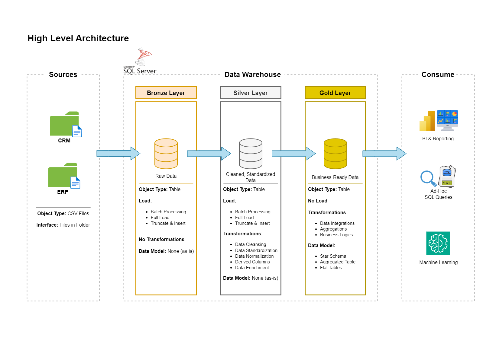

# Data Warehouse and Analytics Project

Welcome to the **Data Warehouse Project** repository! ☄️

This project demonstrates a comprehensive data warehousing and analytics solution, from building a data warehouse to generating actionable insights. Designed as a portfolio project, it highlights industry best practices in data engineering and analytics.

NB: The **[Analytics Project](https://github.com/wisdomadewumi/Data-Analytics-Project)** is on a separate repository!

---
## 📖 Project Overview

This project involves:

1. **Data Architecture**: Implementing a modern data warehouse using the Medallion Architecture, incorporating **Bronze**, **Silver**, and **Gold** layers.
2. **ETL Pipelines**: Extracting, transforming, and loading data from source systems into the data warehouse.
3. **Data Modeling**: Designing and optimizing fact and dimension tables for efficient analytical queries.
4. **Analytics & Reporting**: Building SQL-based reports and dashboards to deliver actionable insights.

---
## ⚙️ Important Links & Tools:

- **[Datasets](datasets/):** Access to the project dataset (csv files).
- **[SQL Server Express](https://www.microsoft.com/en-us/sql-server/sql-server-downloads):** Lightweight server for hosting your SQL database.
- **[SQL Server Management Studio (SSMS)](https://learn.microsoft.com/en-us/ssms/download-sql-server-management-studio-ssms):** GUI for managing and interacting with databases.
- **[Git Repository](https://github.com/):** Set up a GitHub account and repository to manage, version, and collaborate on your code efficiently.
- **[DrawIO](https://www.drawio.com/):** Design data architecture, models, flows, and diagrams.
- **[Notion](https://www.notion.com/):** All-in-one tool for project management and organization.
- **[Notion Project Steps](https://cumbersome-crabapple-5d0.notion.site/Data-Warehouse-Project-SQL-Server-1bc78e9c963880acbb63c4d160efe455):** Access to All Project Phases and Tasks.
- **[Visual Studio Code](https://code.visualstudio.com/):** Tool for programming; I used it to write Markdown files offline.

---
## ☄️ Project Requirements

### 💽 Building the Data Warehouse (Data Engineering)

#### 🥅 Objective
Develop a modern data warehouse using SQL Server to consolidate sales data, enabling analytical reporting and informed decision-making.

#### 📐 Specifications
- **Data Sources**: Import data from source systems (ERP and CRM) provided as CSV files.
- **Data Quality**: Cleanse and resolve data quality issues prior to analysis.
- **Integration**: Combine both sources into a single, user-friendly data model designed for analytical queries.
- **Scope**: Focus on the latest dataset only; historization is not required.
- **Documentation**: Provide documentation of the data model to support both business stakeholders and analytics teams.

---
## 🏯 Data Architecture

The data architecture for this project follows Medallion Architecture **Bronze**, **Silver**, and **Gold** layers:


1. **Bronze Layer**: Contains raw, unprocessed data ingested directly from source systems, such as CSV files, into the SQL Server database.
2. **Silver Layer**:  Focuses on data transformation, including cleansing, standardization, and normalization, to enhance data quality for further analysis.
3. **Gold Layer**: Stores refined, business-ready data structured in a star schema to support reporting and analytics.

---
## 🗃️ Repository Structure
```
Data-Warehouse-Project/
│
├── datasets/                           # Raw datasets used for the project (ERP and CRM data)
│
├── docs/                               # Project documentation and architecture details
│   ├── data_architecture.drawio        # Draw.io file shows the project's architecture
│   ├── data_catalog_gold_layer.md      # Catalog of datasets, including field descriptions and metadata
│   ├── data_flow_diagram.drawio        # Draw.io file for the data flow diagram
│   ├── data_model_gold_layer.drawio    # Draw.io file for data models (star schema)
    ├── integration_model.drawio        # Draw.io file for dataset table relationships
│   ├── naming-conventions.md           # Consistent naming guidelines for tables, columns, and files
│
├── scripts/                            # SQL scripts for DB creation, ETL and transformations
│   ├── bronze_layer_1/                 # Scripts for extracting and loading raw data
│   ├── silver_layer_2/                 # Scripts for cleaning and transforming data
│   ├── gold_layer_3/                   # Scripts for creating analytical models
│
├── tests/                              # Test scripts and quality files
│
├── README.md                           # Project overview and instructions
├── LICENSE                             # License information for the repository
```

---
## 🧩 Skills Showcased

1. **SQL Development** – Strong skills in writing, optimizing, and troubleshooting SQL queries, including window functions, CTEs, subqueries, and performance tuning.
2. **Data Architecture** – Implementing the Medallion Architecture (Bronze, Silver, Gold layers), designing data storage strategies, and structuring a scalable warehouse.
3. **Data Engineering** – Building ETL pipelines, transforming raw data into structured formats, and integrating multiple data sources into a modern data warehouse.
4. **ETL Pipeline Development** – Hands-on experience designing data ingestion, transformation, and loading processes, ensuring data quality and integrity.
5. **Data Modeling** – Designing fact and dimension tables (star schema), optimizing data structures for analytics and reporting.

---
## 🪪 License

This project is licensed under the MIT License. You are free to use, modify and share this project with proper attribution.

## 👨🏽 About Me

Hello friendly stranger! I go by the name **Divine-Wisdom O. Adewumi** and I'm a Biomedical Laboratory Scientist turned Data Analyst on account of my penchant for seeking and finding patterns in data all around us. Insights from data in healthcare, business, education, music and geopolitics tend to pique my interest the most.

We can connect on LinkedIn or you could check my portfolio website:

[](https://www.linkedin.com/in/divine-wisdom-adewumi)
[](https://wisdomadewumi.github.io)

----
## 📝 Shout Out

Thanks to **Data with Baraa**'s YouTube Channel, I was able to not only complete this but understand the excellent intricacies involved in building a data pipeline. He is one of the best (if not the best) teachers on YouTube as regards Data Engineering Data Science and Data Analytics.
Kindly check him out here:

[](https://www.youtube.com/@datawithbaraa)
